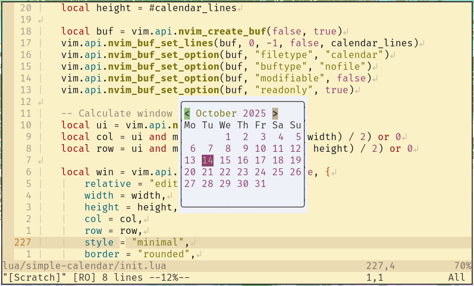

# simple-calendar.nvim

A simple calendar plugin for Neovim.



## Features

- Intuitive navigation using h/j/k/l keys
- Month switching using p/n keys
- Date selection that opens files based on configurable pattern

## Installation

Using [lazy.nvim](https://github.com/folke/lazy.nvim):

```lua
{ "yahorni/simple-calendar.nvim" }
```

## Usage

Open the calendar:

```lua
:lua require('simple-calendar').show_calendar()
```

Or create a keymap:

```lua
vim.keymap.set('n', '<leader>c', require("simple-calendar").show_calendar, { desc = "Open [C]alendar" })
```

## Keybindings

When the calendar is open:

- `h` - Move left to previous day
- `j` - Move down to next week
- `k` - Move up to previous week
- `l` - Move right to next day
- `p` - Switch to previous month
- `n` - Switch to next month
- `<CR>` - Select current date and open corresponding file
- `q` - Close calendar window

## Configuration

No configuration required. Optional setup:

```lua
require("simple-calendar").setup({
    path_pattern = vim.fn.expand("~") .. "/journal/%Y-%m-%d.md"
})
```

## License

GNU Affero General Public License v3.0
