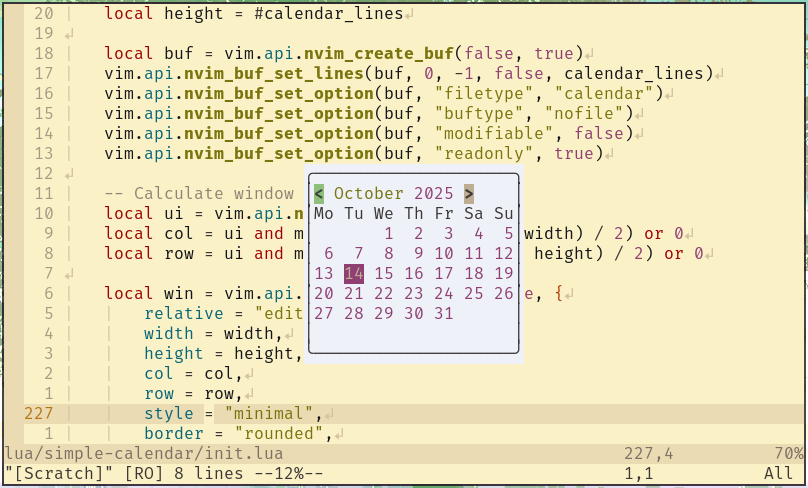

# simple-calendar.nvim

A simple calendar plugin for Neovim.



## Features

- Intuitive navigation using h/j/k/l keys
- Additional Vim-style navigation keys (b/B/w/W/e/E/ge/gE) and arrow keys
- Month switching using p/n keys (and `<C-D>`/`<C-U>` alternatives)
- Date selection that opens files based on configurable pattern

## Installation

Using [lazy.nvim](https://github.com/folke/lazy.nvim):

```lua
{ "yahorni/simple-calendar.nvim" }
```

## Usage

**Open the calendar:**

```lua
:lua require('simple-calendar').show_calendar()
```

When opened, the calendar will automatically show the date from the current filename if it matches the `daily_path_pattern` (e.g., `2024-10-15.md`). Otherwise, it shows the current date.

**Open at a specific date:**

```lua
-- Open calendar at January 15, 2025
require('simple-calendar').show_calendar({ year = 2025, month = 1, day = 15 })
```

The `date` parameter is optional. When provided, it must be a table with `year`, `month`, and `day` fields.

**Create a keymap:**

```lua
vim.keymap.set('n', '<leader>c', require("simple-calendar").show_calendar, { desc = "Open [C]alendar" })
```

## Keybindings

When the calendar window is open:

Key                  | Action
---                  | ---
`h`, `<Left>`        | Move left to previous day
`j`, `<Down>`        | Move down to next week
`k`, `<Up>`          | Move up to previous week
`l`, `<Right>`       | Move right to next day
`b`, `B`, `ge`, `gE` | Move left to previous day
`w`, `W`, `e`, `E`   | Move right to next day
`p`, `<C-D>`         | Switch to previous month
`n`, `<C-U>`         | Switch to next month
`o`, `<CR>`          | Select current date and open corresponding file
`q`, `<Esc>`         | Close calendar window

## Configuration

No configuration required. Default values work out of the box. To customize, provide a configuration table:

```lua
require("simple-calendar").setup({
    -- Path pattern for daily notes (empty by default)
    -- Must be set for date selection and journaling
    daily_path_pattern = "",

    -- Generate daily note paths in lowercase (default: false)
    use_lowercase_daily_path = false,

    -- Highlight days with unfinished tasks (default: false)
    highlight_unfinished_tasks = false,

    -- Completed task markers (default: {"x", "-"})
    completed_task_markers = {"x", "-"},

    -- Skip weekends in journal function (default: false)
    skip_weekends = false,
})
```

### Path Pattern Support

The `daily_path_pattern` supports directory structures with date components:

- **Simple pattern**: `%Y-%m-%d.md` → `2024-10-15.md`
- **Complex patterns**:
  - `%Y-%m %B/%Y-%m-%d.md` → `2024-10 October/2024-10-15.md`
  - `notes/%Y/%m-%B/%Y-%m-%d.md` → `notes/2024/10-October/2024-10-15.md`

Supported strftime tokens:
- `%Y` - 4-digit year (e.g., 2024)
- `%m` - 2-digit month (e.g., 10)
- `%d` - 2-digit day (e.g., 15)
- `%B` - Full month name (e.g., October)
- `%b` - Month abbreviation (e.g., Oct)
- `%A` - Full weekday name (e.g., Tuesday)
- `%a` - Weekday abbreviation (e.g., Tue)

Weekday tokens (`%a`, `%A`) are validated against the extracted date; files with mismatching weekdays won't be recognized.

Set `use_lowercase_daily_path = true` to generate daily note paths in lowercase (e.g., `feb-25-2026-wed.md`). When `false` (default), paths use the case returned by `os.date()` (e.g., `Feb-25-2026-Wed.md`). File matching is exact.

When `daily_path_pattern` is configured (non‑empty), days in the calendar are highlighted according to their status:

- **Days with an existing note file** are shown in **bold** (using the `CalendarDayWithNote` highlight group; customize via `:hi CalendarDayWithNote …`).
- **Days where the file doesn't exist** are dimmed (using the `Comment` highlight group).

If `highlight_unfinished_tasks` is enabled:
- **Days with unfinished markdown tasks** (like `- [ ]`, `* [ ]`, `+ [ ]`) are highlighted with the `Todo` highlight group.
- **Days with only completed tasks** (configurable markers, default: `- [x]`, `- [-]`) are shown as normal days with a note (bold).

Supports `-`, `*`, `+` markdown list markers.

Use `completed_task_markers` to customize which bracket contents mark a task as completed.
Markers must be single characters (e.g., `"x"`, `"-"`, `"✓"`, `"✅"`). Matching is exact - spaces in brackets are not trimmed.

### Skip Weekends Option

The `skip_weekends` option (default: `false`) controls whether weekends are skipped when using the journal function. When enabled:

- On Friday, `calendar.journal("tomorrow")` opens Monday's file (skips Saturday and Sunday)
- On Monday, `calendar.journal("yesterday")` opens Friday's file (skips Saturday and Sunday)
- On Saturday, `calendar.journal("tomorrow")` opens Monday's file (skips Sunday)
- On Sunday, `calendar.journal("yesterday")` opens Friday's file (skips Saturday)

### Journaling

When `daily_path_pattern` is configured (non-empty), you can use the `calendar.journal()` function to open journal files for today, yesterday, tomorrow, or a specific date.
The `daily_path_pattern` configuration must be set to a non-empty string, otherwise `journal()` will display an error.
The function respects the `skip_weekends` configuration option (see Skip Weekends Option above).
If the target file doesn't exist, you'll be prompted to create it.

**Function signature:** `calendar.journal([string_or_date])` where `string_or_date` can be:
- `nil` or omitted → opens today's file (same as `"today"`)
- `"today"` → opens today's file
- `"yesterday"` → opens yesterday's file
- `"tomorrow"` → opens tomorrow's file
- A date table `{ year = Y, month = M, day = D }` → opens the file for that specific date

Only the strings `"yesterday"`, `"today"`, and `"tomorrow"` are supported; other strings will display an error. Date tables must have numeric `year`, `month`, and `day` fields within valid ranges.

**Examples:**

```lua
local calendar = require("simple-calendar")

calendar.journal()                     -- Open today's journal file
calendar.journal("today")              -- Same as above
calendar.journal("tomorrow")           -- Open tomorrow's journal file
calendar.journal("yesterday")          -- Open yesterday's journal file
calendar.journal({ year = 2025, month = 1, day = 15 }) -- Open specific date
```

**Keybinding examples:**

```lua
local calendar = require("simple-calendar")
vim.keymap.set("n", "<leader>d", calendar.journal,
               { noremap = true, desc = "open [d]aily note" })
vim.keymap.set("n", "<leader>t", function() calendar.journal("tomorrow") end,
               { noremap = true, desc = "open [t]omorrow's daily note" })
vim.keymap.set("n", "<leader>y", function() calendar.journal("yesterday") end,
               { noremap = true, desc = "open [y]esterday's daily note" })
```

**Command line usage:**

```bash
nvim -c 'lua require("simple-calendar").journal()'
```

## Testing

Run the tests:

```bash
nvim --headless -u tests/runner.lua
```

## License

MIT License
